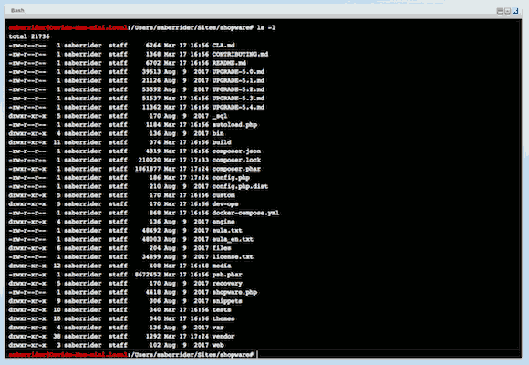

# Command Line in Shopware

This plugin adds command line window (semi-interactive web shell) to the Shopware backend.

It's based on [phpbash](https://github.com/Arrexel/phpbash) by [Arrexel](https://github.com/Arrexel)

Changes to *phpbash*:

* Integration and refactoring of the JavaScript/CSS into ExtJS Components
* Rewritten parts of the PHP code for use in Shopware Controllers and CS reformatting.

## Why?

Because we can.

Obviously it is **highly recommended** to **not** permanently deploy this 
plugin to a production environment. This is ment to be a temporary maintenance tool
in cases where, for whatever reason, there is no access to the actual bash.

## Installation

* Clone this repository into a folder **DnBash** within the **custom/plugins** directory of the Shopware installation.
* Install the plugin through the Plugin-Manager within the Shopware backend.

### Install with composer

* Change to your root installation of shopware
* Run command `composer require dneustadt/dn-bash` and install and activate plugin with Plugin Manager 

## Requirements

* Shopware 5.3.4 or higher
* PHP 7.0